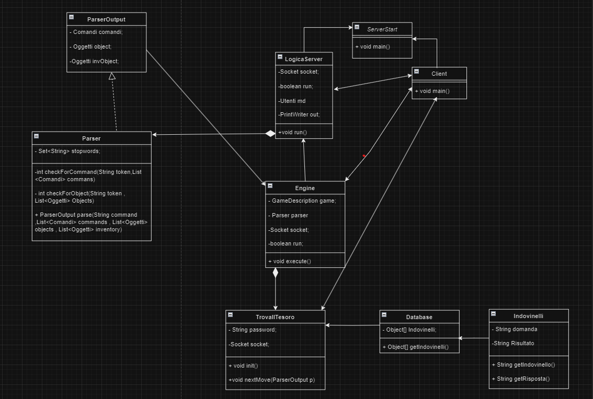

## Descrizione Caso di Studio

### Autori : Picci Vito & Poso Mattia

### Obiettivi
Il progetto dell'avventura testuale nasce con lo scopo di andare a potenziare le capacità di sviluppo del codice del singolo programmatore e di creare intesa nello sviluppo del software lavorando in team, al fine di massimizzare l’efficienza del lavoro.

### Trama Del Gioco
L'avventura testuale ha come protagonista il nipote di uno zio il quale, prima di morire, decide di lasciare la sua eredità nascosta in casa. La storia inizia con il protagonista che si trova all'interno della dimora del suo ormai defunto zio ed ha come obiettivo il ritrovamento dell'eredità. La  dinamica di gioco si svolge all'interno della casa, formata da 9 stanze totali in cui il giocatore dovrà trovare diverse tipologie di oggetti e risolvere degli indovinelli che lo porteranno a scoprire la combinazione della cassaforte.

### Informazioni Di Gestione
Per la creazione del software ci siamo appoggiati alla piattaforma di Hosting GitHub  che ci ha concesso di lavorare insieme sul nostro progetto tenendo traccia delle modifiche apportate al codice sorgente e al controllo della versione. Tramite la piattaforma web il lavoro svolto dal team è stato suddiviso in varie issue al fine di segnalare bug nel software, richiedere nuove funzionalità, discutere su possibili miglioramenti del codice o della documentazione, ecc.

Per la gestione delle dipendenze, dei framework e dell'automazione della build del codice ci siamo affidati ad Apache Maven, che ci ha consentito di specificare le librerie per il progetto in un file di configurazione chiamato "pom.xml".

## Diagramma Delle Classi

## Dettagli Tecnici 

Lo stile architetturale del programma è il modello **Client-Server**. All'avvio dell'applicazione il **Server** starà in ascolto tramite il **socket** di uno o più **Clients**, e una volta che il **Client** effettua la richiesta il **Server** istaura la connessione e crea un **thread**  che si occupa di registrare l'username del **Client** e fa partire l'avventura testuale. Dal punto di vista del **Client**, invece, una volta che viene istaurata la connessione attraverso il **Socket** si effettua la registrazione tramite username e in seguito viene attivato un **Thread** che si occupa di ricevere tutte le informazioni che vengono mandate dal gioco tramite il **Server**. Il programma sfrutta l'utilizzo di un **Database H2** popolato da una tabella contenente gli indovinelli e le relative risposte. In sintesi la funzione del **Database** è quella di restituire delle query generate in maniera casuale dal server per la selezione degli elementi nella tabella, che verranno utilizzati per inserire gli indovinelli nei fogliettini sparsi nella mappa e utilizzare le risposte degli indovinelli per la creazione della combinazione della cassaforte. Lo scopo del **Database** è quello di rendere il gioco più vario e non  monotono, con il risultato in ogni partita di trovare diversi indovinelli da risolvere. Inoltre l'applicazione sfrutta il framework grafico **Swing**, utilizzato per creare un interfaccia con il quale il **Client** può interagire con il gioco. 
Attraverso **Swing** e **AudioThread** vengono visualizzate delle immagini dinamiche, ovvero che cambiano in base all'azione del giocatore, le quali raffigurano tutte le stanze della casa e insieme ad esse viene riprodotta anche la musica per tutta la durata della partita.

